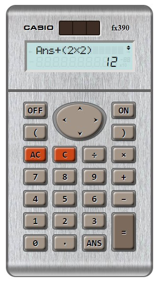

# Calculadora Javascript

La objetivo de este proyecto es complejizar al máximo uno de los ejercicios más básicos y típicos en la programación con javascript para principiantes, **llevándolo al siguiente nivel**.

La idea es conseguir una representación realista, emulando las funcionalidades y la apariencia de una calculadora científica convencional.

[Prueba en linea](https://erme07.github.io/Calculator/)

## :heavy_check_mark: Características:

- Matematica
    - Resolucion de operaciones mediante una expresión matemática
    - No hay limite para la longitud de la expresion a resolver. ( Solo en el numero respresentable como resultado)
    - Admite el uso de parentesis para agrupar operaciones.
    - Acepta las formas alternativas o abreviadas al escribir ciertas expresiones matemáticas ej. 5*(2+2) => 5(2+2).
    - Representa valores en notación científica/exponencial.
- Funcionalidades
    - El resultado de una operacion previa puede ser reutilizado mediante la tecla "Ans"
    - Las ultimas 8 operaciones son guardadas en la "memoria"
    - Las operaciones guardadas en memoria pueden ser editadas y reutilizadas.
    - Las expresiones son editables antes y despues de ser resueltas.
    - La expresion se puede editar, modificando o eliminando los valores seleccionados al mover el cursor.
    - El cursor se mueve mediante los botones direccionales.
    - Detecta y muestra los tipos de errores "Sintax Error" y "Math Error"
- Apariencia
    - Representacion de una pantalla LCD clásica
    - Cursor parpadeante
    - Estilos dinámicos para los botones
    - Flechas en pantalla indican la navegabilidad en la expresion y en las operaciones guardadas en memoria
    - Puede apagarse y encenderse.

## :framed_picture: Captura:

